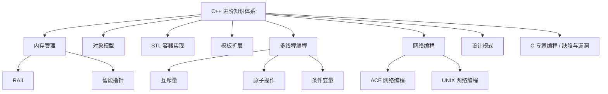

<div align="center">


# 🚀 C++ Plus Plus Promotion

### C++ 进阶编程知识体系文档

一份系统整理的 C++ 进阶学习笔记，涵盖 STL 容器实现、内存管理、多线程编程、网络编程、设计模式等核心主题


</div>

---

## 📖 项目简介

> 这是一个 **C++ 进阶编程** 的文档合集，系统性整理了从语言底层机制到工程实践的核心知识点：
>
> 🧩 STL 容器的实现原理　·　🧠 C++ 内存管理　·　🔍 深度探索 C++ 对象模型
> 🌐 ACE / UNIX 网络编程　·　🔀 多线程编程　·　📐 模板的扩展使用
> 🛠 《C 专家编程》笔记　·　⚠️ C 的缺陷和漏洞
>
> 适合有一定 C++ 基础、希望深入理解语言本质与工程实践的开发者。

---

## 📂 目录结构

| 模块                                                         | 说明                                                   |
| ------------------------------------------------------------ | ------------------------------------------------------ |
| 📁 [C++异常处理](./C++异常处理)                               | C++ 异常处理机制详解                                   |
| 📁 [Cplusplus内存管理](./Cplusplus内存管理)                   | 内存分配、RAII、智能指针等内存管理机制                 |
| 📁 [Cplusplus的多线程编程](./Cplusplus的多线程编程)           | 多线程、条件变量、原子操作、`<threads>` 等并发编程知识 |
| 📁 [GraphView](./GraphView)                                   | 图相关数据结构与可视化                                 |
| 📁 [QT6](./QT6)                                               | Qt6 框架与 CMake 编译配置                              |
| 📁 [STL容器的实现](./STL容器的实现)                           | STL 容器底层实现原理，含数据库 SQL 注入相关笔记        |
| 📁 [UNIX三部曲](./UNIX三部曲)                                 | UNIX 网络编程系列经典笔记                              |
| 📁 [c专家编程](./c专家编程)                                   | 《C 专家编程》读书笔记                                 |
| 📁 [c缺陷和漏洞](./c缺陷和漏洞)                               | 《C 陷阱与缺陷》相关笔记                               |
| 📁 [模板的扩展使用](./模板的扩展使用)                         | C++ 模板高级用法与元编程                               |
| 📁 [深度探索Cplusplus的对象模型](./深度探索Cplusplus的对象模型) | C++ 对象模型底层剖析                                   |
| 📁 [网络](./网络)                                             | ACE 网络编程相关笔记                                   |
| 📁 [设计模式](./设计模式)                                     | 常见设计模式实现，含抽象工厂等                         |

---

## 🧭 知识体系导览



---

## ✨ 特色内容

✅ 系统梳理 STL 容器底层实现原理

✅ 深入剖析 C++ 对象模型与内存布局

✅ 多线程编程实战：互斥锁、条件变量、原子操作

✅ ACE / UNIX 网络编程经典笔记

✅ 模板元编程与高级模板技巧

✅ 《C 专家编程》《C 陷阱与缺陷》读书笔记

✅ 常见设计模式的 C++ 实现

---

## 🚀 快速开始

```bash
# 克隆仓库
git clone https://github.com/darkdark123456/CplusplusPromotion.git

# 进入目录
cd CplusplusPromotion

# 按需查看对应模块的 Markdown 文档
```

> 💡 建议使用 **Typora** 或 **VS Code（配合 Markdown Preview 插件）** 打开文档，以获得最佳的图表和公式渲染效果。

---

## 🤝 贡献

欢迎提交 Issue 或 Pull Request，一起完善这份 C++ 进阶知识体系：

- 🐛 发现文档错误或过时内容
- ✍️ 补充新的知识点或案例
- 💡 提出改进建议

---

## 👤 贡献者

<a href="https://github.com/darkdark123456">
  
</a>

**darkdark123456**（东方佛甲草）

---

## 📜 License

本项目采用 [MIT License](./LICENSE) 开源协议。

---

<div align="center">


如果这份文档对你有帮助，欢迎点个 ⭐ Star 支持一下！

</div>
